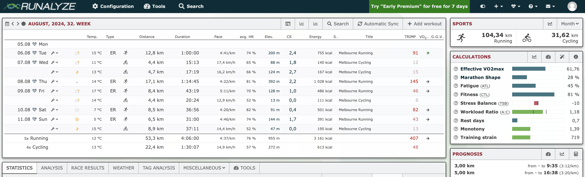

# Running

I run quite a bit. This page compiles some of my general, 5k-specific and marathon-specific running tips and workouts (aimed at intermediate runners). I hope you find them useful!

My current PBs are:

- **5k:** 17:47 (2024 target: sub-17:30)
- **Marathon:** 3:06:08 (2024 target: sub-3hrs)

## General Running Tips

- **Use [Runalyze](https://runalyze.com):**
  - Runalyze is what you'd get if your spreadsheet-loving accountant buddy made a Strava alternative. It's so jam-packed with data and analyses that it can be overwhelming, but once you've got the hang of it I've found it to be really useful.
  - I use it to track my overall fitness metrics + which workouts are improving my V02Max. Oh, and it's (mostly) free 🤯
    _Screenshot of my Runalyze dashboard._
- **Calibrate your Z2 heart-rate:**
  - For ages I was just following the Z2 heart-rate suggestion provided by my Garmin, which was maxing out at `~145bpm`. Then I chanced upon a Reddit post about someone recalibrating their Z2 heart-rates and I decided to do the same.
  - With my max HR of `211`, I've re-calibrated my Z2 to `155-160bpm` (`+10-15bpm`!). This was pretty close to my Strava-suggested zones (so I [edited my Garmin heart-rate zones](https://support.garmin.com/en-AU/?faq=w8qlOr7BQ16Z82HVrevpw9) to match).
  - I still satisfy the ["talk test"](https://www.healthhp.com.au/post/the-talk-test-for-running-zones), feel fine (ie: not exhausting myself) and my fitness, VDot and race times have all noticeably improved.
  - This is more relevant for experienced runners who might be plateauing — typically beginner runnings run too _fast_ to hit their Z2, but I think this inverts once you become more trained and experienced.
- **Avoid injury**
  - Everyone says it, most ignore it, but swapping a workout for a rest day and only doing 95% of your target weekly distance is better than getting injured and doing 0%.

## 5k workout sessions & tips

- A fun speed/endurance sessions I've been doing lately is: **3x(3km @ Z2, 1.6km @ 101-103% _target_ 5k pace):**
  - ie: 3x(3km@4:55/km + 1.6km@3:25-3:30/km) for a target 5k pace of 3:30-3:32/km.
  - That's `~14km` of work, including a cumulative `4.8km` just under your target `5k` pace.
  - I've enjoyed doing this workout as a speed-endurance alternative to a typical 6-8x 1km reps. It's more of an endurance / lactic session though compared to a V02 session (although you could shorten the Z2 component for a more V02 style session).
- **Hill repeats are great to sprinkle in:**
  - Nothing new here, but even just 4x2min hill sprints every other week has had a noticeable effect on my running (feel a bit stronger). Ideally you'd be doing 6-8 reps instead of 4... but sometimes you just have to take what you can get.
- **A few weeks of high-incline running (1500m+ elevation gain) really strengthen the legs:**
  - Like hill repeats on steroids. I spent a few weeks in 2024 staying around a hilly part of Adelaide, getting `1500m+` of elevation gain each week. The results were pretty huge! I just felt a lot stronger in my legs for the next ~8 weeks afterwards, although to be fair, I imagine that doing 1-2 strength workouts each week would have similar results.

## Marathon workout sessions & tips

- **Fueling:**
  - Eat more than you think you need in the race. My first marathon I think I had `~3-4` gels, my most recent one I think I ate `~6.5` gels.
  - It was pretty crazy reflecting on that and realizing that some of my earlier marathon "bonks" could probably be partially-attributed to poor fuelling instead of under-training.
